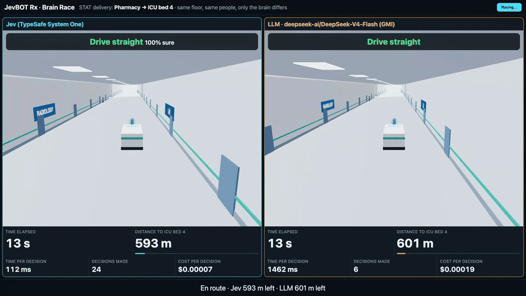

# JevBOT Rx 🏥🤖

**A hospital delivery robot that decides in milliseconds, not seconds.**
JevBOT Rx handles the fetching, so nurses can handle the patients.



▶️ **Full demo video:** [`docs/media/jevbot-rx-brain-race.mp4`](docs/media/jevbot-rx-brain-race.mp4) · 📐 **Architecture (PDF):** [`docs/media/jevbot-rx-architecture.pdf`](docs/media/jevbot-rx-architecture.pdf) · ❓ **Every question asked to Jev:** [`docs/jev-questions.md`](docs/jev-questions.md)

Built in one day at **JEVATHON** (TypeSafe AI × The AI Collective, hosted at CodeRabbit, San Francisco, 2026-09-26). It extends [JevPilot](https://github.com/standardagents/jevpilot) by Standard Agents.

---

## The problem
Hospitals already run delivery robots for medication, blood and lab samples. Staff complain that they **freeze around people and block hallways**. For a STAT delivery, every stalled second is a second a patient waits.

The decision a robot faces a few times per second (*which of these paths, right now?*) needs judgment about people, carts and corridors. An LLM has that judgment, but it's too slow and too costly to call four times a second.

## What we built
- **An indoor hospital floor** in the browser (Three.js): wards and doors, a ceiling with light panels, **400 people and 30 carts or beds** moving through the corridors, and a delivery robot heading from the Pharmacy to ICU bed 4.
- **Jev as the robot's judgment.** About four times a second, code samples 12 candidate 3-second paths and removes any predicted to collide. [Jev](https://typesafe.ai) (TypeSafe's System One model) then picks one, with a probability for each option.
- **A deterministic safety brake.** Code, not a model, guarantees no contact.
- **Brain Race** (`/race.html`): a split screen where the same floor, people, candidate paths, questions and safety brake are driven by **Jev** on one side and **DeepSeek-V4-Flash on GMI Cloud** on the other. The scoreboard shows time, distance to the goal, the live decision, time per decision and cost per decision.

## Results (seed 42, as measured)
| | **Jev** | **DeepSeek-V4-Flash (GMI)** |
|---|---|---|
| Delivery, Pharmacy → ICU bed 4 (run with 40 people) | **84 s** | 115 s: Jev was **30 s sooner** |
| Same delivery with 400 people and 30 carts (video) | **99 s** | 40 m short of the goal when the recording ended |
| Time per decision, p50 / p95 | **≈126 ms / ≈200 ms** | ≈2,500 ms / ≈5,100 ms |
| Cost per decision | **≈$0.00006** | ≈$0.0002 |
| Contacts with the safety brake on | 0 | 0 |

The LLM also sometimes answered with a path that wasn't offered, which the validator rejects. Jev can only choose among the options it's given.

**Stress test** (`race.html?seed=42&stress=1`): the safety brake is off for both robots, and a patient steps into the lane about 2 s ahead. The results were mixed. In one run only the LLM robot hit the patient; in the recorded run, both did. That's too few runs to claim a rate, which is why the safety brake stays on in the real design. See *Limitations*.

## Where the gains come from
- **Time:** Jev returns a probability over the offered options in one pass, with no text generation. The LLM writes thinking tokens and then JSON. A decision that arrives 2–5 s late is about a hallway that no longer exists, so the robot either waits or acts on stale information.
- **Cost:** Jev charges for input only ($0.042 per million tokens) and output is free. The LLM pays for input, output and hidden reasoning tokens on every call.
- **Reliability:** typed answers always name a valid option.

## Architecture
```
Browser (one per robot)                              Server (keys stay here)
Simulation ─▶ Planner worker: 12 paths, predict ─▶  prepareJevRequest(state)
              collisions, drop unsafe ones              ├─ Jev  /v1/systemone  (≈130 ms)
Safety brake (code, every step)                         └─ LLM  GMI chat+JSON  (≈2.5 s)
Apply decision ◀── validate: same batch, offered option, no imminent collision
```
More detail is in [`docs/media/jevbot-rx-architecture.pdf`](docs/media/jevbot-rx-architecture.pdf). The full list of questions Jev is asked, verbatim, is in [`docs/jev-questions.md`](docs/jev-questions.md).

## Run it
```sh
npm ci
cp .env.example .env        # set TYPESAFE_API_KEY and GMI_API_KEY
npm run dev
open "http://localhost:5173/?world=hospital"            # one robot
open "http://localhost:5173/race.html?seed=42"          # Jev vs LLM
open "http://localhost:5173/race.html?seed=42&stress=1" # safety brake off
node scripts/record-race.mjs                            # record to ~/Downloads
node scripts/make-architecture-pdf.mjs                  # architecture PDF
```

## Limitations (honest list)
- The corridors reuse JevPilot's road geometry and scale, so they're wider and the robot is faster than a real hospital robot.
- When a person **stands still in the lane**, the planner stops behind them instead of steering around. Going around needs planner changes (offer bypass paths around stationary people) and is the next item on the roadmap.
- Results are from single runs on one seed, not averages.
- The Jev instructions still contain some wording inherited from driving ("asphalt", "car").

## Roadmap
1. Bypass paths around stationary people, plus a dedicated Jev question: "Is a person about to step into the robot's path?"
2. Realistic speeds (about 1.5 m/s) and true corridor widths.
3. iMessage tasking through Photon: *"STAT blood to OR 2"*, with arrival and blocked alerts.
4. A ROS2 adapter so a physical robot runs the same decision loop.

## Credits
- [JevPilot](https://github.com/standardagents/jevpilot) by Standard Agents: the simulator, planner and Jev integration this builds on.
- [Jev / TypeSafe AI](https://typesafe.ai), [GMI Cloud](https://gmicloud.ai), and the JEVATHON organizers.

---

## Original JevPilot README
# JevPilot

https://github.com/user-attachments/assets/4baef58e-54ef-4d17-9982-353a0b6e6f45

<p align="center">
  <a href="https://jevpilot.standardagents.ai">
    
  </a>
</p>

A demo project showing Tesla Autopilot-like behavior using [Jev by TypeSafe AI](https://typesafe.ai/).

Sign in with Standard Agents for $0.25 of free Jev play credit. Joining the early-access list is optional.

The hosted `/api/decide` endpoint requires a valid login session. The browser sends its secure, HttpOnly session cookie; the Jev API key stays on the server.

**Interstate 08:** start in Millbrook, turn onto the signed on-ramp, merge, cruise, and exit into Cedar Town for the final stop.

## How it works

Jev receives compact tables of eligible paths, road boundaries, nearby traffic, signals, stop memory, and destination guidance. Shared table values are sent once, and instructions include only relevant situations. The road graph is sent only when choosing an alternative route after staying more than 30 meters off course for six seconds. Detailed geometry and control calculations stay local.

The simulator samples fresh steering-and-speed combinations for each decision. On the road, it favors paths that keep the whole car on asphalt. Off road, it explores a wider field of forward and reverse paths and supplies a recovery target, road boundaries, and collision predictions.

An explicit `driving_style` describes an aggressive driver: keep progressing, stop at the actual line, and close gaps before stopping behind an obstacle. Jev can choose an approach path that progressively slows to a stop 0.5 m before the line. An immediate **stop** is offered only within 2.5 m of a blocker or required stop line, at the destination, or when no eligible moving path exists. Candidate speeds taper near required stops. Jev receives recent-stop memory and collision timing; a safety brake handles collision risks.

Use **Candidates** to show the sampled paths: blue/cyan for forward, purple for reverse, amber for paths leaving the lane, orange for predicted collisions, and bright blue for Jev’s selection. Candidate generation and route searches run in a background worker; the renderer smoothly blends the sampled shapes. Open **JSON** to inspect road boundaries, recovery state, and actual choice probabilities.

Requests run up to 4 times/second near turns or traffic, and about 1.5 times/second on clear roads. Questions with one eligible answer are resolved locally. **JSON → Jev input** shows the exact API payload; the cost tooltip and response tab show average payload size and billed input tokens.

## Run locally

```sh
npm ci
cp .env.example .env
# Set TYPESAFE_API_KEY in .env.
npm run dev
```

Add your own [TypeSafe AI](https://typesafe.ai/) API key to `.env`:

```dotenv
TYPESAFE_API_KEY=your_key_here
```

Open [localhost:5173](http://localhost:5173). **Local development skips all login, signup, and demo credit limits.** No Standard Agents OAuth credentials are needed. Jev calls use your own key and TypeSafe account billing; free play works without a key. The key stays server-side in the gitignored `.env`—never use a `VITE_` variable for it.

This also applies to `npm run preview` after `npm run build`. Restart the local server after changing `.env`.

**J** toggles autopilot · **WASD** to drive · **Space** to brake.

Asset credits and licenses are included in [public/](public/).

Cloudflare deployment details: [docs/hosting.md](docs/hosting.md).
