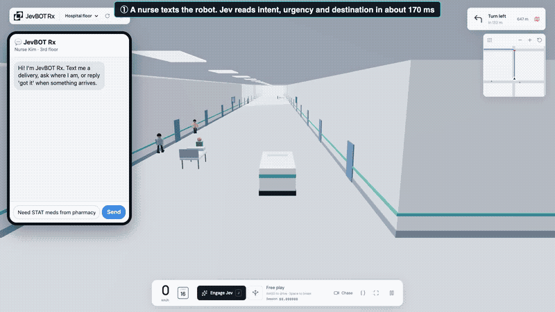

# JevBOT Rx 🏥🤖

**A hospital delivery robot that decides in milliseconds, not seconds.**
JevBOT Rx handles the fetching, so nurses can handle the patients.



▶️ **60-second demo (5×):** [`docs/media/jevbot-rx-demo-5x.mp4`](docs/media/jevbot-rx-demo-5x.mp4) · **Full race video:** [`docs/media/jevbot-rx-brain-race.mp4`](docs/media/jevbot-rx-brain-race.mp4) · 📐 **Architecture (PDF):** [`docs/media/jevbot-rx-architecture.pdf`](docs/media/jevbot-rx-architecture.pdf) · ❓ **Every question asked to Jev:** [`docs/jev-questions.md`](docs/jev-questions.md)

### Key metrics at a glance
The same 20 real robot decisions were sent to every model, with the same inputs and each LLM on its fastest setting.

| | **Jev (TypeSafe)** | DeepSeek-V4-Flash | GPT-6 luna | GPT-6 sol | GPT-6 astra |
|---|---|---|---|---|---|
| **Time per decision (p50)** | **143 ms** | 2,275 ms | 2,302 ms | 2,349 ms | 3,387 ms |
| Time per decision (p95) | **373 ms** | 5,080 ms | 3,842 ms | 4,503 ms | 9,494 ms |
| **Cost per decision** | **$0.000074** | $0.000197 | $0.000129 | $0.002262 | $0.013206 |
| Valid answers | **20/20** | 18/20 | 20/20 | 18/20 | 20/20 |
| **Hospital delivery, Pharmacy → ICU bed 4** | **157 s** | 232 s | — | — | — |
| Stress test collisions (brake off) | **0 of 2 runs** | 2 of 2 runs | — | — | — |

Jev is **16–24× faster per decision** than every LLM tested, and cheaper per decision than all of them. The full delivery race and stress test were run against DeepSeek-V4-Flash only.

Built in one day at **JEVATHON** (TypeSafe AI × The AI Collective, hosted at CodeRabbit, San Francisco, 2026-09-26). It extends [JevPilot](https://github.com/standardagents/jevpilot) by Standard Agents.

---

## The problem
Hospitals already run delivery robots for medication, blood and lab samples. Staff complain that they **freeze around people and block hallways**. For a STAT delivery, every stalled second is a second a patient waits.

The decision a robot faces a few times per second (*which of these paths, right now?*) needs judgment about people, carts and corridors. An LLM has that judgment, but it's too slow and too costly to call four times a second.

## What we built
- **An indoor hospital floor** in the browser (Three.js): wards and doors, a ceiling with light panels, **400 people and 30 carts or beds** moving through the corridors, and a delivery robot heading from the Pharmacy to ICU bed 4.
- **Jev as the robot's judgment.** About four times a second, code samples 12 candidate 3-second paths and removes any predicted to collide. [Jev](https://typesafe.ai) (TypeSafe's System One model) then picks one, with a probability for each option.
- **A deterministic safety brake.** Code, not a model, guarantees no contact.
- **Brain Race** (`/race.html`): a split screen where the same floor, people, candidate paths, questions and safety brake are driven by **Jev** on one side and **DeepSeek-V4-Flash on GMI Cloud** on the other. The scoreboard shows time, distance to the goal, the live decision, time per decision and cost per decision.

## Nurse ⇄ robot texting
Nurses task the robot by text (the phone panel in `?world=hospital`). Jev reads each message in about 120–220 ms with three typed questions: **intent** (new delivery, status, cancel, confirm receipt), **urgency** (routine, urgent, STAT) and **destination**. The robot texts back with an ETA, answers "where are you?", and texts when it arrives. Video: [`docs/media/jevbot-rx-nurse-texting.mp4`](docs/media/jevbot-rx-nurse-texting.mp4). Real iMessage delivery through Photon is on the roadmap. The demo's phone panel is in-app.

## Results (seed 42, 400 people, 30 carts, realistic speed, as measured)
| | **Jev** | **DeepSeek-V4-Flash (GMI)** |
|---|---|---|
| **Delivery, Pharmacy → ICU bed 4** (safety brake on) | **157 s** | 232 s: Jev was **75 s sooner** |
| Time per decision (p50) | **129 ms** | 1,882 ms |
| Decisions made during the delivery | **370** | 65 |
| Cost per decision | **$0.00007** | $0.00020 |
| Contacts, safety brake on | 0 | 0 |
| **Stress test** (safety brake off for both; patients step into the lane about 2 s ahead) | **0 collisions in 2 of 2 runs, delivered in 159 s** | Hit the patient in 2 of 2 runs (36 s, 41 s) |

Videos: [main race](docs/media/jevbot-rx-brain-race.mp4) · [stress test](docs/media/jevbot-rx-stress-test.mp4). The LLM also sometimes named a path that wasn't offered, which the validator rejects; Jev can only choose among the options it's given.

**What made Jev collision-free in the stress test:** the robot runs at a realistic indoor speed (about 16 km/h in sim units). Jev is also offered a full **stop** as soon as a person is within about 9 m of the path, not only at 2.5 m. It took that option ("Stop, 71% sure"), waited, then continued. The LLM had the same options, but its answers arrived about 2 s late, while the robot was still executing a stale decision.

## Benchmark: Jev vs GPT-6 on the same decisions
We captured 94 real decision requests from a hospital run and replayed 20 of them, evenly spaced, through each model. The inputs were identical. Every LLM used its fastest reasoning setting. Script: `scripts/brain-benchmark.mjs`; raw numbers: `docs/brain-benchmark.json`.

| Model | Time per decision p50 / p95 | Valid answers | Same choice as Jev | Cost per decision |
|---|---|---|---|---|
| **Jev (TypeSafe)** | **143 ms / 373 ms** | **20/20** | — | **$0.000074** |
| GPT-6 astra (GMI) | 3,387 / 9,494 ms | 20/20 | 15/20 | $0.013206 |
| GPT-6 sol (GMI) | 2,349 / 4,503 ms | 18/20 | 12/20 | $0.002262 |
| GPT-6 luna (GMI) | 2,302 / 3,842 ms | 20/20 | 13/20 | $0.000129 |
| DeepSeek-V4-Flash (GMI) | 2,275 / 5,080 ms | 18/20 | 11/20 | $0.000197 |

"Same choice as Jev" measures agreement, not correctness; several paths are often equally good.

## Where the gains come from
- **Time:** Jev returns a probability over the offered options in one pass, with no text generation. The LLM writes thinking tokens and then JSON. A decision that arrives 2–5 s late is about a hallway that no longer exists, so the robot either waits or acts on stale information.
- **Cost:** Jev charges for input only ($0.042 per million tokens) and output is free. The LLM pays for input, output and hidden reasoning tokens on every call.
- **Reliability:** typed answers always name a valid option.

## Architecture
```
Browser (one per robot)                              Server (keys stay here)
Simulation ─▶ Planner worker: 12 paths, predict ─▶  prepareJevRequest(state)
              collisions, drop unsafe ones              ├─ Jev  /v1/systemone  (≈130 ms)
Safety brake (code, every step)                         └─ LLM  GMI chat+JSON  (≈2.5 s)
Apply decision ◀── validate: same batch, offered option, no imminent collision
```
More detail is in [`docs/media/jevbot-rx-architecture.pdf`](docs/media/jevbot-rx-architecture.pdf). The full list of questions Jev is asked, verbatim, is in [`docs/jev-questions.md`](docs/jev-questions.md).

## Run it
```sh
npm ci
cp .env.example .env        # set TYPESAFE_API_KEY and GMI_API_KEY
npm run dev
open "http://localhost:5173/?world=hospital"            # one robot
open "http://localhost:5173/race.html?seed=42"          # Jev vs LLM
open "http://localhost:5173/race.html?seed=42&stress=1" # safety brake off
node scripts/record-race.mjs                            # record to ~/Downloads
node scripts/make-architecture-pdf.mjs                  # architecture PDF
```

## Limitations (honest list)
- The corridors reuse JevPilot's road geometry and scale, so they're wider and the robot is faster than a real hospital robot.
- Results are from two runs on one seed, not a statistical study.
- When a person **stands still in the lane**, the planner stops behind them instead of steering around. Going around needs planner changes (offer bypass paths around stationary people) and is the next item on the roadmap.
- The Jev instructions still contain some wording inherited from driving ("asphalt", "car").

## Roadmap
1. Bypass paths around stationary people, plus a dedicated Jev question: "Is a person about to step into the robot's path?"
2. Realistic speeds (about 1.5 m/s) and true corridor widths.
3. iMessage tasking through Photon: *"STAT blood to OR 2"*, with arrival and blocked alerts.
4. A ROS2 adapter so a physical robot runs the same decision loop.

## Credits
- [JevPilot](https://github.com/standardagents/jevpilot) by Standard Agents: the simulator, planner and Jev integration this builds on.
- [Jev / TypeSafe AI](https://typesafe.ai), [GMI Cloud](https://gmicloud.ai), and the JEVATHON organizers.
